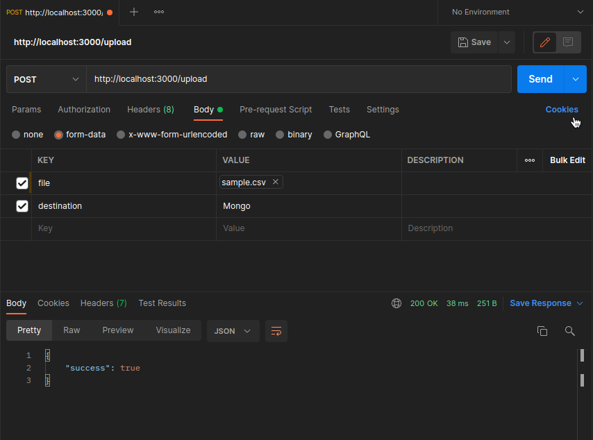

# Process csv and xml files

## Process and save data to mongo

Read file, transform data and save to local or to mongo atlas

### How to run this project

- Create an account on mongo atlas [Link Here](https://www.mongodb.com/atlas/database)
- Set your credential on .env file
- Run the test `yarn test`
- Run the project `yarn dev`

### Route POST

destination: Local or Mongo
```
POST http://localhost:3000/upload
```
BODY form-data

> the sample files you can find on `src/data`
```
{
  file: sample.csv
  destination: Local
}
```
PAYLOAD
```json
{
  "success": true
}
```
### Route GET

the get route find documents on mongodb

```
GET http://localhost:3000/upload
```
```json
{
  {
    "docs": [
        {
            "_id": "624a0077642d164fd3dcda65",
            "Transaction": "Invoice0000001",
            "Amount": "1,000.00",
            "CurrencyCode": "USD",
            "TransactionDate": "20/02/2019 12:33:16",
            "Status": "Approved"
        },
        {
            "_id": "624a0077642d164fd3dcda66",
            "Transaction": "Invoice0000002",
            "Amount": "300.00",
            "CurrencyCode": "USD",
            "TransactionDate": "21/02/2019 02:04:59",
            "Status": "Failed"
        }
    ]
  },
  "count": 12
}
```

### Preview 



### Use on your project
- Copy the files to your project 
- Call the function `processFileService`
- You can provide an file from uploaded

Any question feel free to message me [Linkedin](https://www.linkedin.com/in/alessandro-l-menezes-57906b71/)


#### References

[node doc](https://nodejs.org/docs/latest-v15.x/api/stream.html#stream_event_pipe)
[node-js-stream](https://www.geeksforgeeks.org/node-js-stream-pipeline-method/)
